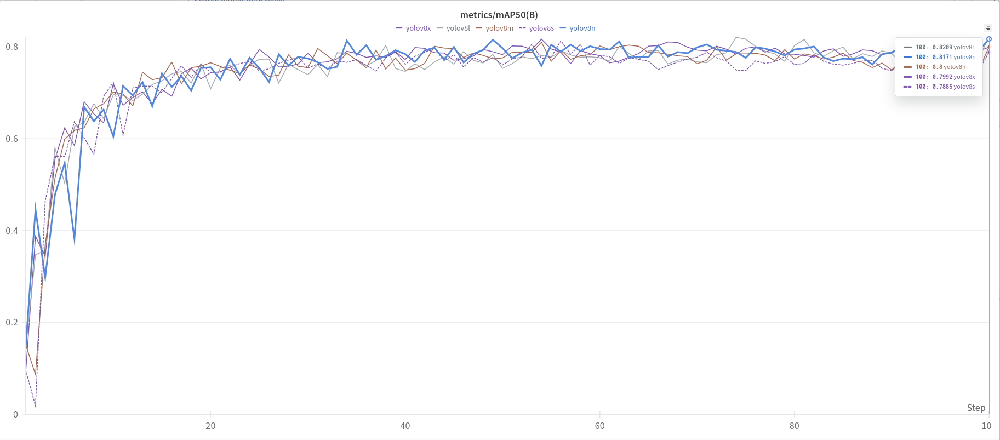

<div align="center">
  <a href="https://bit.ly/3NMFz8D">
    
  </a>
</div>

# YOLOv8 for crack segmentation 🚀

This repository contains the Ultralytics YOLOv8 models trained on the [Crack-seg dataset](https://docs.ultralytics.com/datasets/segment/crack-seg/) by [OpenSistemas](https://bit.ly/3NMFz8D), a comprehensive resource designed for crack segmentation tasks in road and wall scenarios. The dataset includes 4029 static images divided into training (3717 images), testing (112 images), and validation (200 images) sets.


<div align="center">
  <a href="https://bit.ly/3NMFz8D">
    
  </a>
</div>

# YOLOv8 Crack-seg Models 📦

This repository contains the Ultralytics YOLOv8 models trained on the Crack-seg dataset, a comprehensive resource designed for crack segmentation tasks in road and wall scenarios. The dataset includes 4029 static images divided into training (3717 images), testing (112 images), and validation (200 images) sets.

## Included Models 🤖

- **yolov8n-seg**: Optimized for fast inference on edge devices.
- **yolov8s-seg**: Small model, balancing speed and accuracy.
- **yolov8m-seg**: Medium model, offering higher accuracy at moderate inference speeds.
- **yolov8l-seg**: Large model, designed for high accuracy in resource-abundant environments.
- **yolov8x-seg**: Extra-large model, achieving the highest accuracy, suitable for research and development.

Each model variant is tailored to different computational and accuracy requirements, from the lightweight `n` variant to the most powerful `x` variant.

## Dataset 🌍

The Crack Segmentation Dataset is crucial for applications in infrastructure maintenance, automated systems for road safety, and more, by enabling precise identification and assessment of structural damage through crack detection.

### Dataset Structure

- **Training set:** 3717 images
- **Testing set:** 112 images
- **Validation set:** 200 images

## Results

For detailed performance metrics of the YOLOv8 models on the Crack-seg dataset, refer to our comprehensive experiment analysis on [Weights & Biases](https://wandb.ai/hdnh2006/crack-seg). This includes accuracy, inference times, mAP, Precision, Recall and other relevant metrics to evaluate the models effectiveness in crack detection tasks.

<div align="center">
  <a href="https://wandb.ai/hdnh2006/crack-seg">
    
  </a>
</div>

### Usage 🔧

To predict a YOLOv8 model on this dataset, just follow these instructions:
```bash
git clone https://huggingface.co/OpenSistemas/YOLOv8-crack-seg
pip install ultralytics
yolo segment predict model=YOLOv8-crack-seg/yolov8n/weights/best.pt
						   YOLOv8-crack-seg/yolov8s/weights/best.pt
						   YOLOv8-crack-seg/yolov8m/weights/best.pt
						   YOLOv8-crack-seg/yolov8l/weights/best.pt
						   YOLOv8-crack-seg/yolov8x/weights/best.pt
```


## Contact and information 🌐
We are OpenSistemas, a spanish company specializing in providing innovative technology solutions and services. We focus on areas such artificial intelligence, data science, data management, analytics, cloud computing and big data, aiming to enhance business efficiency and drive digital transformation for our clients.

If you want to know more about us, don't forget to visit our [website](https://bit.ly/3NMFz8D)
